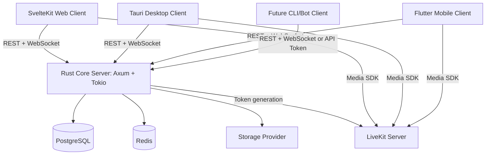

# Multi-Client Architecture

## 1. Architecture principle

Rust.chat must be designed as a **client-agnostic server** with multiple clients.



## 2. Server responsibilities

The Rust server owns:

- auth;
- sessions/tokens;
- permission checks;
- invite logic;
- role logic;
- channel visibility;
- message persistence;
- realtime fan-out;
- attachment metadata;
- media token generation;
- audit logs.

## 3. Client responsibilities

Clients own:

- rendering;
- local navigation;
- local cache;
- reconnect behavior;
- notifications;
- device permissions;
- platform-specific UX.

Clients do not own:

- final permission decisions;
- final channel visibility decisions;
- raw storage credentials;
- LiveKit API secrets;
- direct database access.

## 4. Client types

### Web client

Recommended stack:

- SvelteKit;
- TypeScript;
- Tailwind;
- shadcn-svelte/Bits UI style components.

Use cases:

- browser access;
- admin panel;
- fast MVP iteration;
- debugging and server management.

### Desktop client

Recommended stack:

- Tauri;
- Svelte UI reused from web where possible;
- Rust sidecar/commands only for platform integrations.

Use cases:

- Windows desktop;
- macOS desktop;
- Linux desktop;
- tray icon;
- notifications;
- auto-update later;
- better file system integration.

Desktop client should still call the same remote/local server API.

### Mobile client

Recommended stack:

- Flutter;
- Dart API client generated or maintained from OpenAPI;
- WebSocket client;
- LiveKit Flutter SDK for voice/video.

Use cases:

- Android;
- iOS;
- push notifications;
- camera/microphone permission handling;
- background audio later.

## 5. Recommended repository layout

```text
Rust.chat/
  apps/
    server/            # Rust Axum backend
    web/               # SvelteKit web client
    desktop/           # Tauri desktop shell using Svelte UI or shared web package
    mobile/            # Flutter app

  packages/
    web-ui/            # optional shared Svelte components
    api-contracts/     # OpenAPI schema, generated clients, event schemas

  infra/
    docker-compose.dev.yml
    caddy/
    livekit/

  context/
    *.md
```

## 6. API contract strategy

The API must be stable enough for multiple clients.

Use:

- OpenAPI for REST DTOs;
- versioned WebSocket event schema;
- semantic API versioning;
- typed error codes;
- deprecation policy.

Example:

```text
/api/v1
```

Do not break `/api/v1` casually once mobile exists.

## 7. Authentication strategy

Recommended initial strategy:

- Web and Tauri: cookie session or bearer token stored securely.
- Mobile: bearer access token + refresh token stored in secure storage.
- Future bot/CLI: scoped API tokens.

Important:

- do not design auth only around browser cookies;
- support Authorization header for native clients;
- still protect browser cookie flows against CSRF.

## 8. Realtime strategy

All clients use the same WebSocket endpoint:

```text
GET /api/v1/ws
```

Auth methods:

- session cookie;
- Authorization bearer token;
- short-lived WebSocket token.

Events must be JSON and versionable.

## 9. Media strategy

Rust server issues LiveKit tokens. Clients connect directly to LiveKit using platform SDKs.

Web/Desktop:

- LiveKit web/JS SDK.

Mobile:

- LiveKit Flutter SDK.

The server does not proxy audio/video streams.

## 10. Storage strategy

All clients upload attachments through the Rust API, not directly to storage provider in MVP.

Flow:

```text
Client -> Rust API -> FileStorage provider
```

Later, direct-to-storage signed uploads can be added.

## 11. Client feature parity

Do not require full feature parity at once.

Suggested order:

1. Web: complete MVP and admin controls.
2. Desktop: chat, notifications, file upload, voice.
3. Mobile: login, lobby, chat, notifications, voice/video later.
