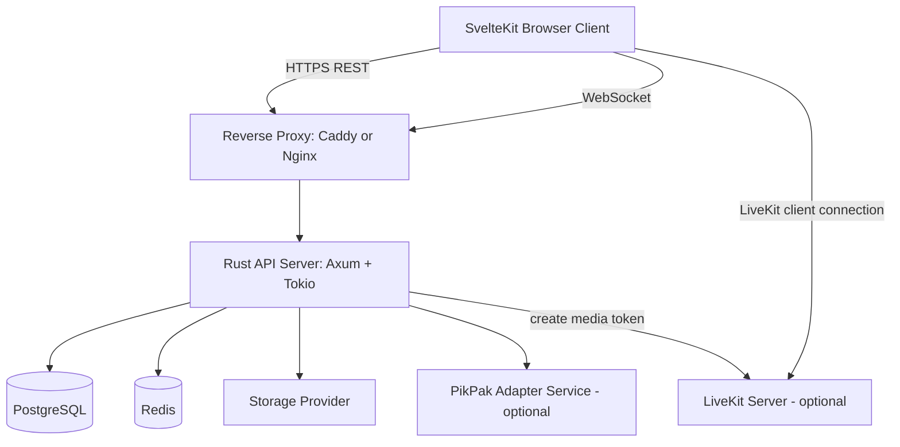
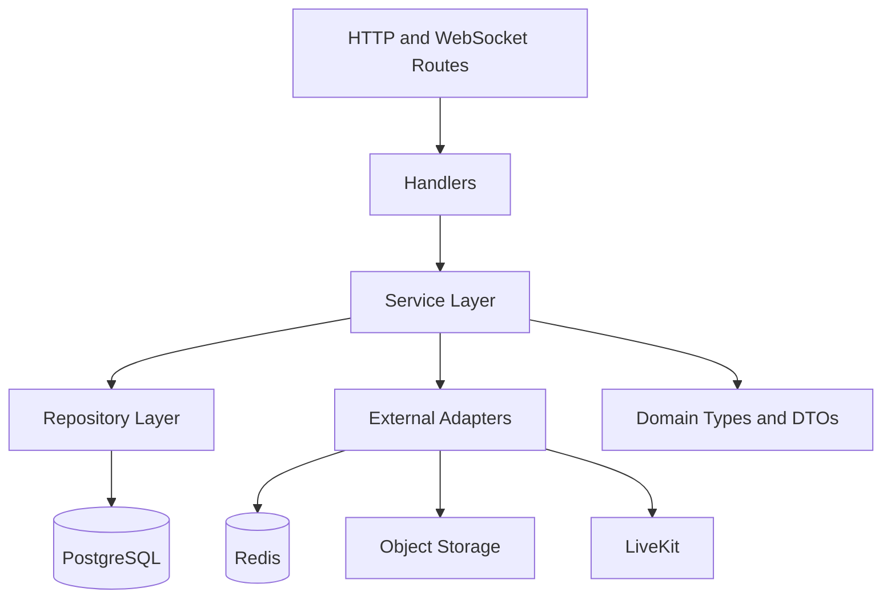
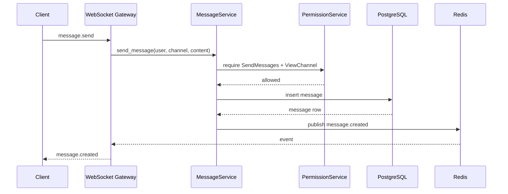
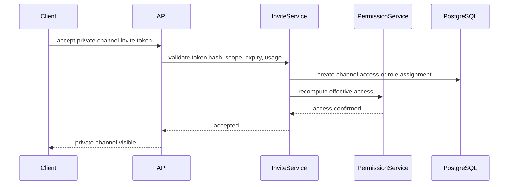

# Overall Architecture

## 1. High-level architecture



## 2. Architectural decision summary

| Area | Decision | Reason |
|---|---|---|
| Backend framework | Axum | Rust-native async web framework with WebSocket extractor and Tower ecosystem |
| Runtime | Tokio | Rust async runtime for I/O, timers, scheduling, tasks |
| Database | PostgreSQL | Strong relational model for users, spaces, roles, messages, audit logs |
| Database access | SQLx | Explicit SQL, migrations, compile-time checking possible |
| Cache/ephemeral | Redis | Presence, typing, rate limit state, pub/sub |
| Frontend | SvelteKit + TypeScript | Good routing, component model, typed frontend |
| Styling | Tailwind + component primitives | Fast UI iteration with ownership of component code |
| Realtime text | WebSocket | Needed for chat, presence, typing |
| Voice/video | LiveKit | Avoid building SFU/WebRTC complexity from scratch |
| File storage | Pluggable adapter | VPS disk is limited; avoid hardcoding one provider |
| PikPak | Optional adapter | Useful experiment, but isolate because it is an unofficial Python implementation |

## 3. Backend layers



Rules:

- Handlers parse input and return responses.
- Services own business logic.
- Repositories own SQL.
- Adapters own external systems.
- Domain types must be shared by services.
- Permission checks belong to `PermissionService`, not UI or route handlers alone.
- Sensitive actions must write audit logs.

## 4. Runtime services

### PostgreSQL

Stores durable state:

- users;
- profiles;
- instance settings;
- spaces;
- memberships;
- roles;
- permissions;
- channels;
- channel feature flags;
- messages;
- attachments metadata;
- file object metadata;
- audit logs;
- user themes.

### Redis

Stores short-lived state:

- presence;
- typing indicators;
- WebSocket fan-out;
- rate limit counters;
- temporary invite checks;
- ephemeral channel tokens;
- pub/sub across multiple API processes.

### Storage provider

Stores large binary data.

The backend should store only metadata and references in PostgreSQL.

### LiveKit

Handles SFU responsibilities for group voice/video. The Rust backend only creates tokens after permission checks.

## 5. Suggested monorepo layout

```text
Rust.chat/
  apps/
    server/
      src/
        main.rs
        config/
        domain/
        routes/
        handlers/
        services/
        repositories/
        realtime/
        storage/
        media/
        audit/
        auth/
        permissions/
      migrations/
      Cargo.toml

    web/
      src/
        routes/
        lib/
          api/
          realtime/
          components/
          stores/
          theme/
      package.json
      svelte.config.js

  context/
    *.md

  infra/
    docker-compose.dev.yml
    caddy/
    livekit/

  .env.example
  README.md
```

## 6. Request flow: send message



## 7. Request flow: join private channel



## 8. Deployment modes

### MVP single VPS

```text
Caddy/Nginx
  -> Rust API server
  -> SvelteKit Node server or static frontend
PostgreSQL container
Redis container
External storage provider
LiveKit optional container
```

### Production-ready small deployment

```text
Reverse proxy
Rust API server replicas
Managed or self-hosted PostgreSQL
Managed or self-hosted Redis
External object storage
Dedicated LiveKit instance if media traffic grows
```

## 9. Scaling path

Start simple:

1. one API process;
2. one PostgreSQL;
3. one Redis;
4. local dev storage;
5. optional external object storage.

Then scale:

1. multiple API replicas;
2. Redis pub/sub for realtime fan-out;
3. object storage provider;
4. dedicated LiveKit VM;
5. message table partitioning if needed.
